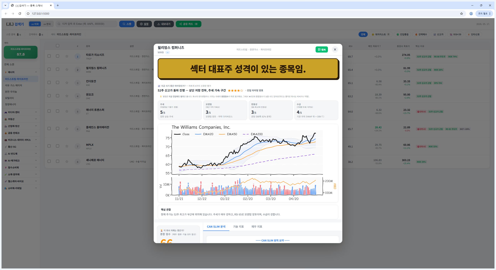
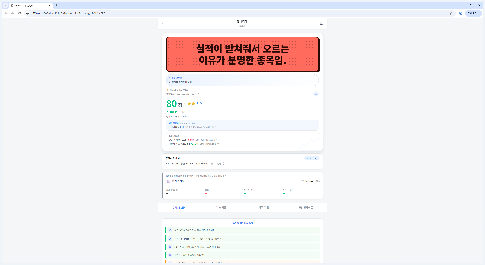
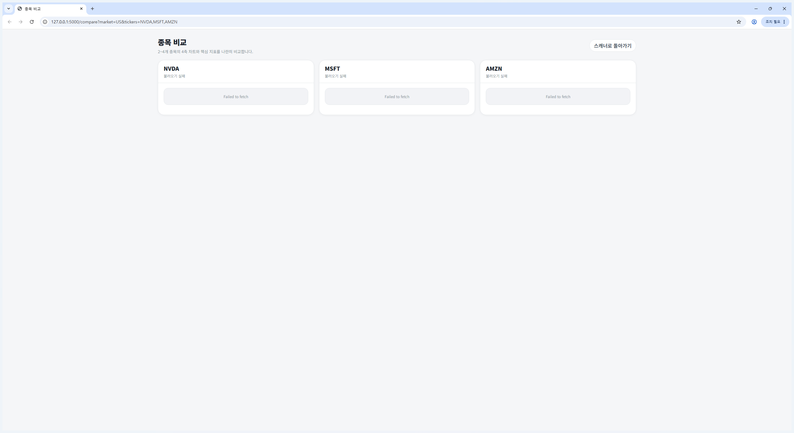
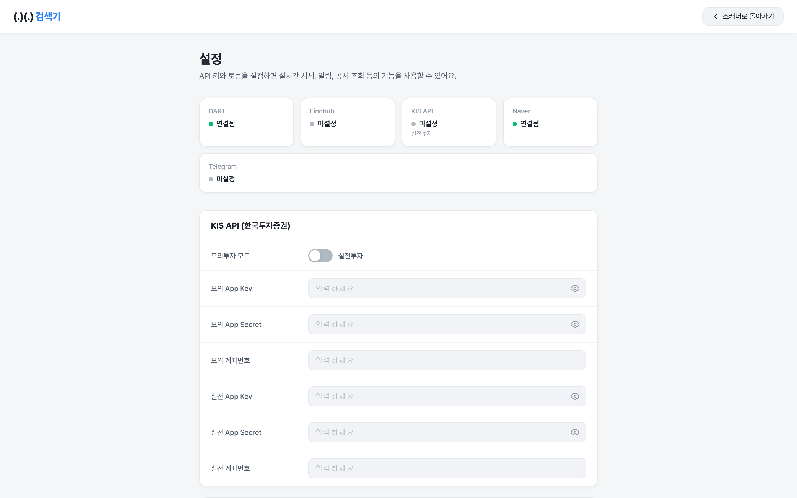
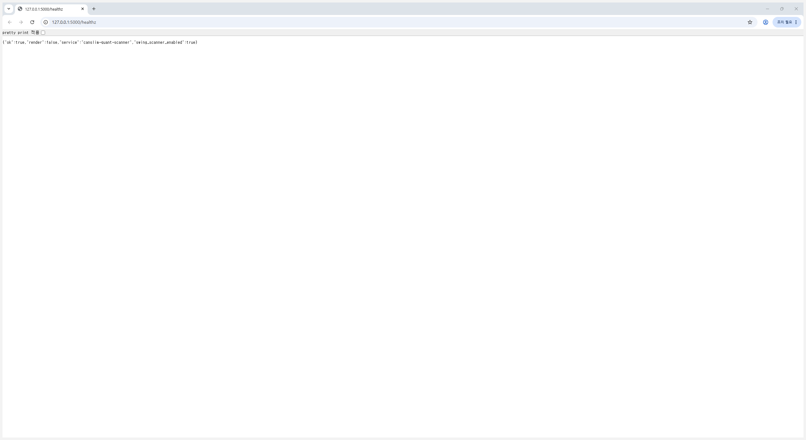

# canslim-quant-scanner

> CAN SLIM 원칙, 퀀트 팩터, 진입 타이밍 점수를 한 화면에 묶은 미국/한국 주식 스캐너.



## Features

- CAN SLIM 스타일의 종목 평가와 점수화
- 미국/한국 주식 스캔
- 종목별 상세 해설과 원라이너 코멘트
- 진입가, 손절가, 목표가를 포함한 진입 타이밍 카드
- 거시 지표를 요약하는 상단 매크로 스트립
- `/settings`에서 로컬 API 설정 관리
- `/healthz` 헬스체크와 Render/Oracle 배포 문서 포함

## Current UI

### 홈 화면


현재 홈 화면에는 다음이 반영되어 있습니다.

- 상단 매크로 스트립: 시장 상태, 금리, 환율, VIX 같은 거시 지표를 빠르게 확인
- 접이식 섹터 히트맵: 좌측에서 섹터 흐름을 먼저 보고 종목으로 내려갈 수 있음
- 스캔 테이블: 종합 점수, 진입 상태, 브로커 목표가, 핵심 이유를 한 줄로 요약

### 종목 상세 화면



상세 화면은 예전보다 "무슨 행동을 해야 하는지"가 먼저 보이도록 정리했습니다.

- 진입 타이밍 카드가 `결론 / 행동 / 더보기` 구조로 정리됨
- `진입가 / 손절 / 목표가1`를 먼저 보여주고 나머지는 접어서 표시
- 종합 점수와 진입 타이밍을 함께 보는 2축 사분면 추가
- 별점 영역은 차트 타이밍용, 종합 점수는 회사/종목 평가용으로 역할을 분리

### 종목 비교 화면



비교 화면에서는 종목 간 점수와 톤 차이를 빠르게 볼 수 있습니다.

### 설정 화면



`/settings`에서는 로컬 `config.json` 기반으로 API 키와 토큰을 저장할 수 있습니다.

### 헬스체크



배포 후에는 `/healthz`로 서버 상태를 빠르게 확인할 수 있습니다.

## Entry Timing

이 프로젝트의 진입 타이밍 점수는 "좋은 회사인가"와 "지금 들어갈 자리인가"를 분리해서 봅니다.

- 종합 점수: 회사/종목의 전반적 질과 매력도
- 진입 타이밍: 지금 매수해도 되는 자리인지

현재 UI에서는 이 차이를 더 명확하게 보여주기 위해 다음을 반영했습니다.

- 진입 카드 헤드라인을 더 크게 표시
- 보조 사유를 별도 줄로 분리
- 가격 액션에서 가장 중요한 3개 숫자만 먼저 노출
- 점수 분해와 AgentQuant 근거는 펼쳤을 때만 확인

## Quick Start

### Requirements

- Python 3.11+
- Windows, macOS, Linux
- 선택 사항: KIS, DART, Finnhub, Telegram 등 외부 API

### Install

```bash
git clone https://github.com/gunchinam/canslim-quant-scanner.git
cd canslim-quant-scanner
pip install -r requirements.txt
```

### Run

```bash
python -m web_app.app
```

Windows에서는 배치 파일로 실행할 수도 있습니다.

```bat
run_quant_nexus.bat
```

브라우저에서 `http://127.0.0.1:5000`으로 접속하면 됩니다.

## Configuration

- 로컬 설정 화면: `/settings`
- 로컬 설정 파일: `config.json`
- 공개용 예시 파일: `config.example.json`

실제 API 키, 토큰, 계좌번호는 공개 저장소에 넣지 않는 전제로 동작합니다.

## Deployment

### Render

- `render.yaml` 포함
- 시작 명령: `gunicorn --bind 0.0.0.0:$PORT wsgi:app`
- 운영 환경에서는 실제 비밀값을 Render 환경변수로 넣는 편이 맞음

주의할 점:

- `/settings`가 쓰는 `config.json`은 Render 재배포 시 영속 저장소가 아님
- Render에서는 필요하지 않으면 백그라운드 SWING 스캐너를 끄는 편이 안전함
- 필요할 때만 `ENABLE_SWING_SCANNER=true` 사용

### Oracle Cloud

- [Oracle Cloud 가이드](deploy/ORACLE_CLOUD.md)
- [초기 세팅 스크립트](deploy/setup-oracle.sh)

## Public Repo Notes

- 실제 비밀값은 `.env` 또는 로컬 `config.json`에만 저장
- `config.example.json`만 커밋하고 `config.json`은 커밋하지 않음
- 토큰 캐시, 로컬 UI 상태, 데이터 산출물은 `.gitignore`로 제외
- `data/`, `*.parquet`, `.kis_token_cache.json`, `_*.json` 같은 로컬 산출물은 공개 제외

## Tests

```bash
pytest tests/test_entry_status_v2.py tests/test_entry_status_v3.py
```

## License

[MIT License](LICENSE)
