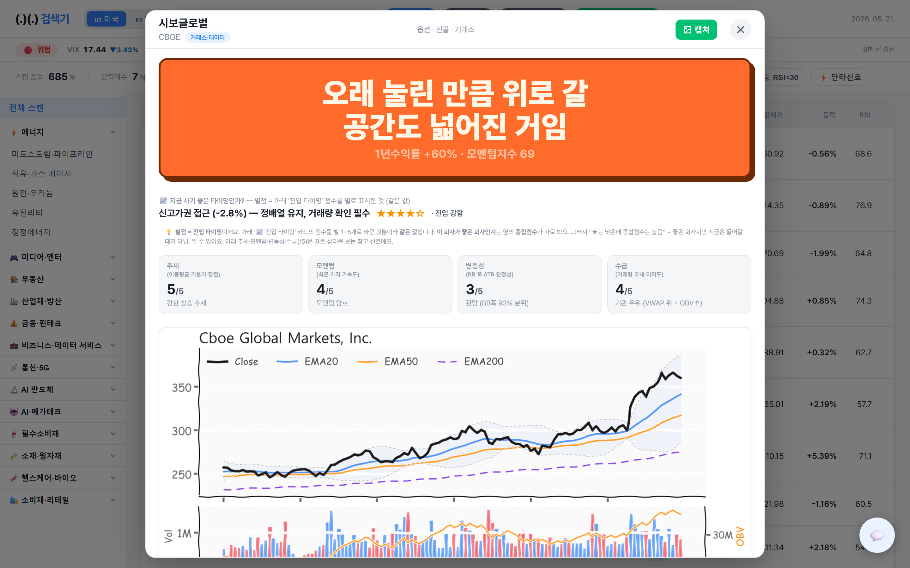

<div align="center">

# (.)(.) 검색기

**CAN SLIM + Quant Factor + Entry Timing**

"좋은 회사인가"와 "지금 들어갈 자리인가"를 동시에 답하는<br>
미국/한국 주식 스캐너

[](https://python.org)
[](https://flask.palletsprojects.com)
[](https://docker.com)
[](LICENSE)

<br>


</div>

---

## 주요 기능

| 기능 | 설명 |
|------|------|
| **CAN SLIM 종목 평가** | 실적 성장, 수급, 모멘텀을 5개 전략으로 종합 점수화 |
| **US + KR 동시 스캔** | Yahoo Finance, 네이버, DART, Finnhub 데이터 통합 |
| **진입 타이밍 카드** | 진입가, 손절가, 목표가를 한눈에 제시 |
| **한줄평 코멘트** | 주갤 커뮤니티 톤의 2,600+ 구문 풀에서 종목별 한 줄 평가 |
| **매크로 스트립** | VIX, 환율, 금리, KOSPI, S&P500 실시간 요약 |
| **실시간 채팅** | WebSocket 익명 채팅 + 관리자 기능 (공지, 차단, 삭제) |
| **퀵필터** | 워치리스트, 진입 임박, 감시 매수, 신고가, RSI, 단타 신호 |
| **종목 비교** | 체크박스로 선택 후 종목 간 점수·차트·한줄평 비교 |

---

## 스크린샷

### 스캔 결과


상단 매크로 스트립으로 시장 상태를 확인하고, 종합 점수·진입 상태·증권사 목표가·핵심 이유를 한 줄로 스캔합니다.

### 종목 상세



진입 타이밍 카드 → 차트 → 점수 분해 순서로, "무슨 행동을 해야 하는지"가 먼저 보입니다.

### 설정


`/settings`에서 API 키와 토큰을 브라우저에서 바로 관리합니다.

---

## Quick Start

### 요구 사항

- Python 3.11+
- Windows / macOS / Linux

### 로컬 실행

```bash
git clone https://github.com/gunchinam/canslim-quant-scanner.git
cd canslim-quant-scanner
pip install -r requirements.txt
python -m web_app.app
```

`http://127.0.0.1:5000`으로 접속합니다.

### Docker 실행

```bash
cp .env.example .env    # API 키 설정 (선택)
docker compose up --build
```

`http://localhost:8000`으로 접속합니다.

---

## 설정

| 방법 | 경로 |
|------|------|
| 웹 UI | `/settings` |
| 파일 | `config.json` (`.gitignore` 대상) |
| 환경변수 | `.env` 또는 Docker 환경변수 |

외부 API는 선택 사항입니다. 없어도 Yahoo Finance 기반 핵심 스캔은 동작합니다.

| API | 용도 |
|-----|------|
| **DART** | KR 공시·재무제표 |
| **Finnhub** | US 뉴스·실적 캘린더 |
| **Naver** | KR 증권사 목표가 (키 불필요) |
| **Telegram** | 알림 전송 |

---

## 배포

### Docker (권장)

```bash
docker compose up -d --build
```

- 포트 `8000` (docker-compose.yml에서 변경 가능)
- `.env` 파일로 API 키 주입
- `app-data`, `yfinance-cache` 볼륨으로 영속 데이터 관리
- 30초 간격 헬스체크, 실패 시 자동 재시작

### Render

- `render.yaml` 포함
- 시작 명령: `gunicorn --bind 0.0.0.0:$PORT wsgi:app`

### Oracle Cloud

- [Oracle Cloud 가이드](deploy/ORACLE_CLOUD.md)
- [초기 세팅 스크립트](deploy/setup-oracle.sh)

---

## 채팅 관리자

실시간 채팅에 관리자 기능이 내장되어 있습니다.

- 채팅 패널의 🔒 아이콘 → 비밀번호 입력으로 관리자 모드 진입
- 기본 비밀번호: `admin1234` (환경변수 `CHAT_ADMIN_PW`로 변경)
- 메시지 삭제, 사용자 차단, 공지사항, 전체 삭제 지원

---

## 테스트

```bash
pytest tests/
```

---

## 보안

- 실제 비밀값은 `.env` 또는 `config.json`에만 저장
- `config.json`, 토큰 캐시, 데이터 산출물은 `.gitignore` 대상
- `config.example.json`만 커밋

---

## License

[MIT](LICENSE)
