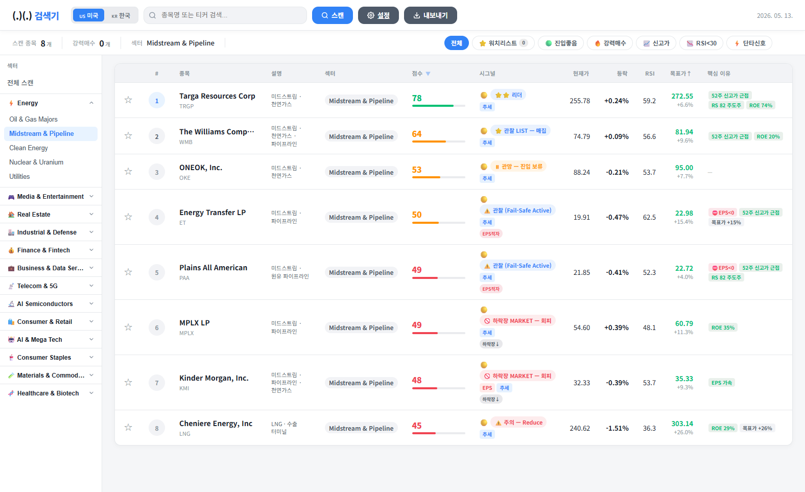
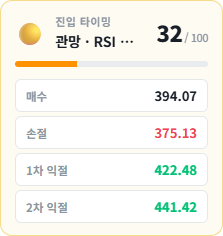
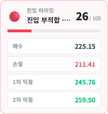
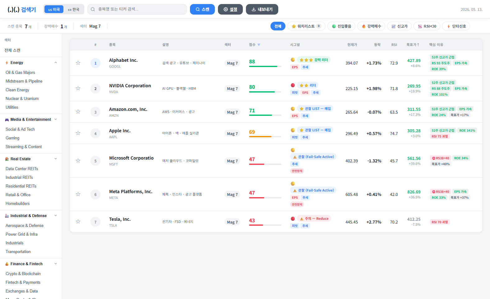
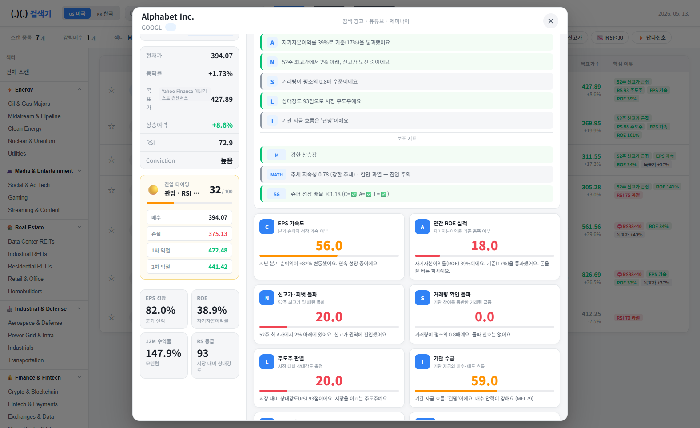

# canslim-quant-scanner

> CAN SLIM 원칙 + 13개 퀀트 팩터 + 백테스트 검증된 진입 타이밍 신호를 결합한
> 미국·한국 주식 종목 스캐너.



---

## ✨ Features

### 핵심
- **CAN SLIM 7요소 채점** — 윌리엄 오닐의 검증된 7가지 기준 (C / A / N / S / L / I / M)
- **13개 퀀트 팩터** — Fama-French, Carhart Momentum, Mean Reversion, Smart Money Flow,
  Kalman Filter, Hurst Exponent, Stat Arb Z-Score 등
- **백테스트 검증된 진입 타이밍** — `V4_HYBRID` 점수 함수 (3년 × 200종목 × 97k 시점 검증)
- **5가지 전략 모드** — BALANCED / CAN_SLIM / MOMENTUM / VALUE / SCALPING
- **ATR 기반 자동 매매가** — 매수 / 손절 / 1차 익절 / 2차 익절 자동 산출
- **52개 섹터 필터** — 메가테크부터 광물·우라늄까지

### UI
- Flask 기반 웹 대시보드 (`http://127.0.0.1:5000`)
- 종목 클릭 시 상세 패널 — 21개 점수 항목 한국어 해설
- 손그림풍 차트 렌더링 (`handdrawn_renderer.py`)
- 어제 대비 점수/순위 변동 표시

---

## 🎯 진입 타이밍 신호 (Entry Timing)

스캐너의 핵심 차별점. 단순히 "지금 좋은 종목"을 보여주는 게 아니라
**"지금 들어갈 타이밍인가"** 를 점수로 답합니다.

### 등급
| 등급 | 점수 | 의미 |
|------|------|------|
| 🟢 **GREEN** | ≥ 75 | 진입 좋음 — 백테 기준 +10일 평균 +2.60%, 승률 60% |
| 🟡 **YELLOW** | 30 ~ 74 | 관망 — 신호 혼조 |
| 🔴 **RED** | < 30 | 진입 부적합 — 과열/약세 |

### 백테스트 결과 (US 100 + KR 100, 3년치, 97k obs)

| 점수 함수 | GREEN 비중 | GREEN +10d | edge vs baseline |
|-----------|------------|------------|------------------|
| V1_OLD (평균회귀) | 2.2% | +2.38% | +1.12% |
| V2_NEW (추세추종) | 1.0% | +2.36% | +0.95% |
| **★ V4_HYBRID (현재)** | **1.8%** | **+2.60%** | **+1.72%** |
| V5_MOMENTUM_PIVOT | 0.8% | +1.93% | +0.55% |

> Baseline = 전체 시점 무선택 평균 (+10d: +1.46%)
> edge = GREEN 시점 +10d − RED 시점 +10d

### V4_HYBRID 공식 (요약)
```
베이스 50점
+ RSI < 30           → +14 (과매도 반등)
+ BB 하단            → +10
+ VWAP 살짝 눌림     → +5
+ MA 정배열 & 거래량 점프 → +14  ★ 핵심
+ MA 정배열 & ATR 수축    → +6
+ 신고가 + 거래량 동반    → +10
+ MACD 골든 임박       → +6
- RSI > 70           → -12
- 약세장 / 강한 약세장 → -10 / -18
- 급등 직후 추격 (>+7%) → -10
```

### 실제 화면
스캔 결과 클릭 시 진입 카드가 표시됩니다.

| YELLOW 사례 (구글) | RED 사례 (엔비디아) |
|-------------------|-------------------|
|  |  |
| RSI 72 과열로 관망 권고 | 과열·MACD 약세로 추격 금지 |

매수가/손절/1차익절/2차익절은 모두 ATR 기반 자동 계산.

---

## 📊 화면

### 스캔 결과


### 종목 상세


각 점수 항목을 한국어로 풀어서 설명. 예:
- *"C🔥 분기 실적이 2분기 연속 가속 성장 중이에요"*
- *"N🚀 52주 최고가에서 2% 아래, 신고가 도전 중이에요"*
- *"[M] STRONG_BULL ✅ — ADX 48"*

---

## 🚀 Quick Start

### 요구사항
- Python 3.11 이상 (3.13 권장)
- 인터넷 (yfinance / DART / KIS)
- Windows / macOS / Linux 모두 동작

### 설치
```bash
git clone https://github.com/<your-name>/canslim-quant-scanner.git
cd canslim-quant-scanner
pip install -r requirements.txt
```

### 환경변수 설정 (선택)
```bash
cp .env.example .env
# .env 편집하여 API 키 입력 (옵션)
```

> **yfinance만 써도 미국 주식 스캔 가능.** KIS/DART 키는 한국 주식 + 공시 기능용.

### 실행
```bash
# 웹 대시보드
python -m web_app.app

# 또는 (Windows)
run_quant_nexus.bat
```

브라우저에서 `http://127.0.0.1:5000` 접속.

---

## 🔑 API 키 발급 (선택)

| API | 용도 | 발급처 | 비용 |
|-----|------|--------|------|
| **KIS** | 한국 주식 실시간 시세 | https://apiportal.koreainvestment.com/ | 무료 |
| **DART** | 한국 기업 공시·재무 | https://opendart.fss.or.kr/ | 무료 (분 100건) |
| **Telegram** | 진입 신호 알림 | @BotFather | 무료 |
| **OpenAI** | 뉴스 요약 (선택) | https://platform.openai.com/ | 유료 |

자세한 설정은 `.env.example` 참고.

---

## 📂 구조

```
canslim-quant-scanner/
├── quant_nexus_v20.py        # 메인 스코어링 엔진 (~7000 lines)
├── web_app/                  # Flask 웹 대시보드
│   ├── app.py
│   ├── templates/scanner.html
│   └── static/app.js
├── backtest/                 # 백테스트 엔진
│   ├── entry_timing_backtest.py
│   ├── score_variants_test.py
│   └── threshold_sweep.py
├── handdrawn_renderer.py     # 손그림 차트 렌더러
├── four_axis_analyzer.py     # 4축 분석 (가치/성장/모멘텀/품질)
├── dart_api.py               # DART OpenAPI 클라이언트
├── kis_api.py                # KIS OpenAPI 클라이언트
├── kr_company_info.py        # 한국 종목 사전
├── us_company_info.py        # 미국 종목 사전
├── alert_rules.py            # 알림 규칙 엔진
├── telegram_notifier.py
└── tests/
```

---

## 🧪 백테스트 직접 돌리기

```bash
# 1. 기본 백테 (entry timing OLD vs NEW)
python backtest/entry_timing_backtest.py --period 3y --n-us 100 --n-kr 100

# 2. 임계값 스윕
python backtest/threshold_sweep.py

# 3. 점수 함수 변종 비교 (V1~V6)
python backtest/score_variants_test.py
```

캐시는 `backtest/cache/` 에 parquet으로 저장. 첫 실행만 느리고 그 다음부터 즉시.

---

## ⚠️ 면책 조항

- 본 소프트웨어가 산출하는 점수·신호·분석은 **교육 및 정보 제공 목적**입니다.
- **투자 자문이 아닙니다.** 모든 투자 결정과 손익은 사용자 본인 책임입니다.
- 과거 성과는 미래 수익을 보장하지 않습니다.
- 백테스트 결과는 과거 데이터 기반이며 실제 시장 미체결·슬리피지를 반영하지 않습니다.

---

## 📜 라이선스

## Public Repo Notes

- Keep real API keys, bot tokens, and account numbers only in `.env` or local `config.json`.
- Commit `.env.example` and `config.example.json`, but never commit live credentials.
- Token caches, local UI state, and files under `swing_scan/state/` are excluded from the public repo.

[MIT License](LICENSE)

---

## 🤝 기여

이슈/PR 환영. 특히:
- 새 퀀트 팩터 제안
- 더 나은 점수 함수 백테 결과 (V7 이상)
- 다른 시장(JP/HK/EU) 지원
- 모바일 UI 개선

---

## 📚 참고

- 윌리엄 오닐, *How to Make Money in Stocks* (CAN SLIM 원전)
- Fama & French, *Common risk factors in the returns on stocks and bonds* (1993)
- Carhart, *On Persistence in Mutual Fund Performance* (1997)

---

## Render Deployment

- This repo includes `render.yaml` for a Render web service and uses `gunicorn --bind 0.0.0.0:$PORT wsgi:app`.
- On Render, create a new Blueprint or Web Service from this repository.
- Set any real API credentials in the Render dashboard as environment variables. Do not commit them.
- The `/settings` page writes to local `config.json`, which is not persistent across Render redeploys or instance restarts. Use Render environment variables for production settings.
- The background SWING scanner is disabled by default on Render. Set `ENABLE_SWING_SCANNER=true` only if you intentionally want that behavior in a suitable environment.
